

  

  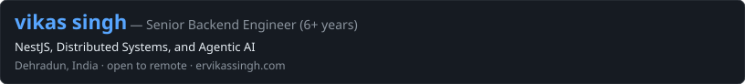

  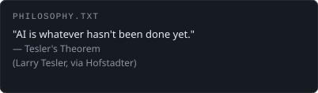
  &nbsp;
  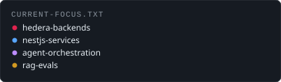

  
  &nbsp;
  
  &nbsp;
  <a href="https://linkedin.com/in/ervikassingh">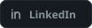</a>
  &nbsp;
  <a href="https://x.com/wiekkii">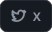</a>
  &nbsp;
  <a href="https://instagram.com/wiekki">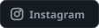</a>

  

  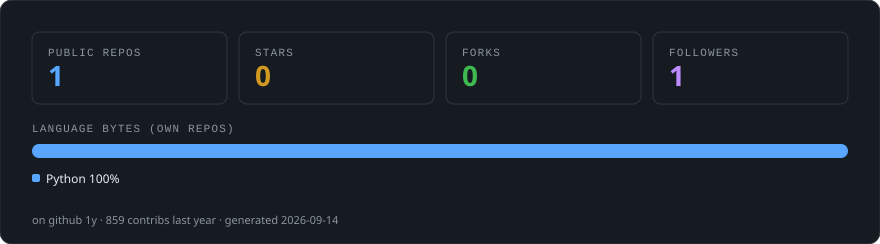

  

  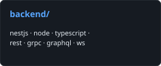
  &nbsp;
  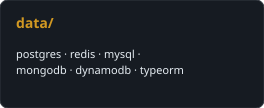
  &nbsp;
  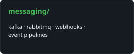

  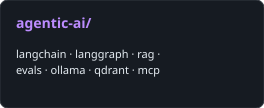
  &nbsp;
  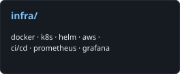
  &nbsp;
  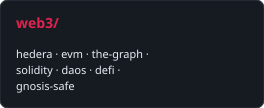

  

  <a href="https://www.hashgraph-group.com/">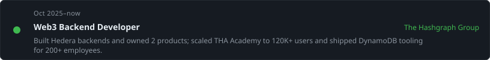</a>

  <a href="https://appinventiv.com/">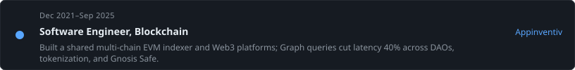</a>

  <a href="https://www.ebizondigital.com/">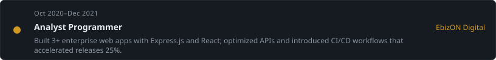</a>

  

  <a href="https://github.com/ervikassingh/agent-orchestration">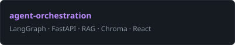</a>
  &nbsp;
  <a href="https://github.com/ervikassingh/custom-ai-agent">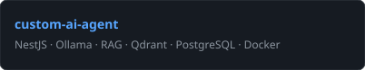</a>

  <a href="https://github.com/ervikassingh/prompt-relay-landing">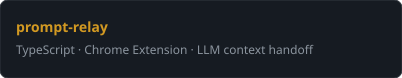</a>
  &nbsp;
  <a href="https://github.com/ervikassingh/nestjs-microservices-template">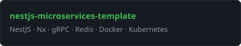</a>

  <a href="https://github.com/ervikassingh/nestjs-monolithic-template">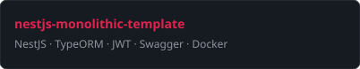</a>

  

  <a href="https://certs.hashgraphdev.com/e815d99e-dad3-463e-9553-f2723446c0c6.pdf">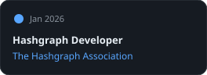</a>
  &nbsp;
  <a href="https://profiles.cyfrin.io/u/ervikassingh/achievements/noir-programming-and-zk-circuits">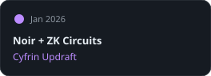</a>
  &nbsp;
  <a href="https://profiles.cyfrin.io/u/ervikassingh/achievements/fundamentals-of-zero-knowledge-proofs">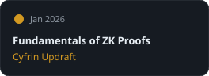</a>

